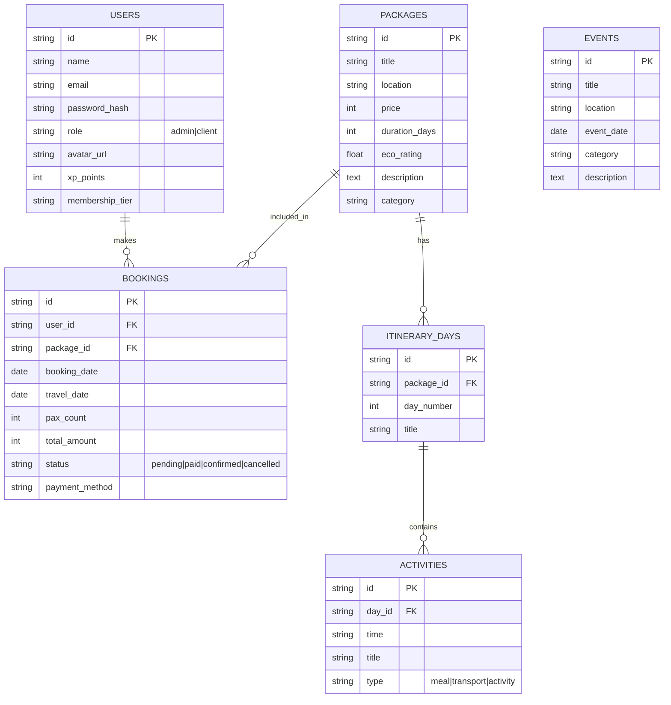

# Entity Relationship Diagram (ERD)

Meskipun saat ini menggunakan Mock Data, berikut adalah rancangan skema database relasional untuk BorneoTrip.

## Penjelasan Entitas

1.  **USERS**: Menyimpan data pengguna, baik traveler maupun admin. Menyimpan progres gamifikasi (XP/Tier).
2.  **PACKAGES**: Produk utama yang dijual. Berisi info dasar harga dan lokasi.
3.  **BOOKINGS**: Tabel transaksi. Menghubungkan User dengan Package. Punya status daur hidup transaksi.
4.  **ITINERARY_DAYS & ACTIVITIES**: Struktur detail untuk itinerary paket. Relasi One-to-Many berjenjang.
5.  **EVENTS**: Entitas terpisah untuk kalender event, tidak selalu transaksional (bisa hanya informatif).
