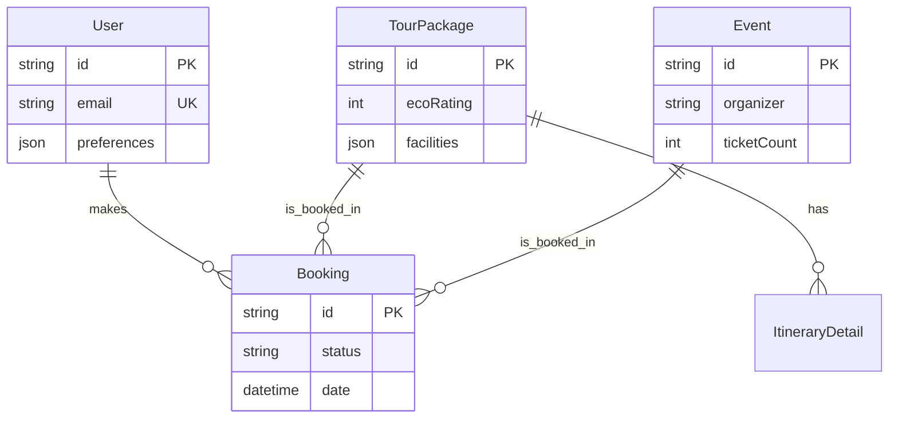
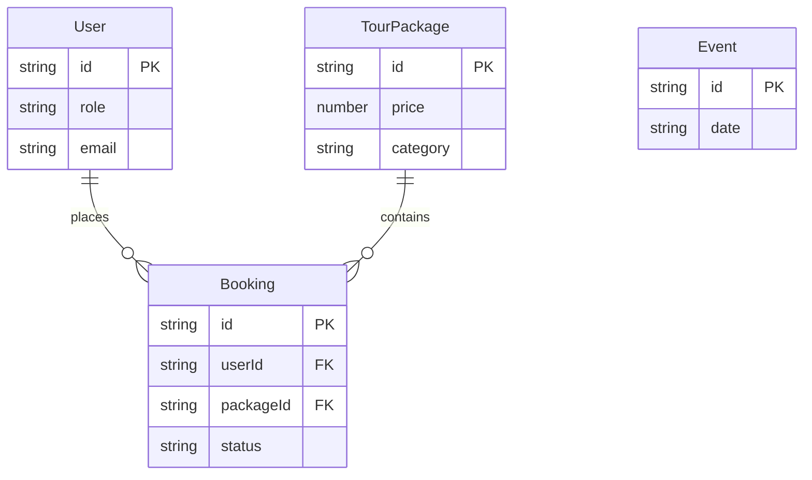

# Entity Relationship Diagram (ERD) - BorneoTrip

Dokumen ini menjelaskan struktur data yang digunakan dalam aplikasi.

## 1. Current Implementation (Mock Data Strategy)

Saat ini, karena aplikasi berjalan dalam mode **Frontend-First (Hackathon Demo)**, kami menggunakan struktur data JSON yang disimpan di `localStorage` klien untuk mensimulasikan persistensi database. Struktur ini dirancang agar mudah dimigrasikan ke schema SQL production nantinya.

### JSON Entities (Client-Side Storage)

#### User
*Key: `bt_users`*
| Key | Type | Description |
| :--- | :--- | :--- |
| `id` | string | Unique identifier (e.g., `'usr1'`) |
| `name` | string | Nama lengkap user |
| `email` | string | Email login |
| `role` | enum | `'client' | 'admin' | 'mitra'` |
... (Fields aligned with localStorage implementation)

## 2. Target Production Schema (MySQL)

Untuk fase production, kami telah merancang schema database yang lebih robust menggunakan MySQL/MariaDB. Berikut adalah spesifikasi teknisnya:

### Schema Overview



### SQL Definition

```sql
-- User Management
CREATE TABLE `User` (
  `id` varchar(191) NOT NULL PRIMARY KEY,
  `email` varchar(191) NOT NULL UNIQUE,
  `role` varchar(50) DEFAULT 'client',
  `preferences` json DEFAULT NULL
);

-- Core Products
CREATE TABLE `TourPackage` (
  `id` varchar(191) NOT NULL PRIMARY KEY,
  `title` varchar(191) NOT NULL,
  `price` int NOT NULL,
  `ecoRating` int NOT NULL DEFAULT 0,
  `facilities` json DEFAULT NULL
);

CREATE TABLE `Booking` (
  `id` varchar(191) NOT NULL PRIMARY KEY,
  `userId` varchar(191) NOT NULL,
  `packageId` varchar(191),
  `status` varchar(50) DEFAULT 'pending',
  FOREIGN KEY (`userId`) REFERENCES `User`(`id`)
);
```

*Note: For full SQL dump, please refer to `/mysql_schema.sql` in the root directory.*

### 2. TourPackage (Paket Wisata)
Menyimpan data produk wisata.
| Key | Type | Description |
| :--- | :--- | :--- |
| `id` | string | PKG-ID (e.g., `'pkg-derawan'`) |
| `title` | string | Nama paket wisata |
| `category` | string | Kategori (Nature, Culture, Adventure) |
| `duration` | string | Durasi (e.g., "3 Days 2 Nights") |
| `price` | number | Harga per pax dalam Rupiah |
| `location` | string | Lokasi utama |
| `rating` | number | Rating bintang (1.0 - 5.0) |
| `description` | string | Deskripsi singkat listing |
| `details` | object | Detail lengkap (overview, timeline) |
| `badges` | array | Label khusus (`['sustainable', 'best-seller']`) |

### 3. Event (Event Tahunan)
Menyimpan data festival atau event khusus.
| Key | Type | Description |
| :--- | :--- | :--- |
| `id` | string | Event ID |
| `title` | string | Nama event |
| `date` | string | Tanggal pelaksanaan |
| `location` | string | Tempat pelaksanaan |
| `description` | string | Deskripsi event |
| `price` | number | Harga tiket masuk (0 jika gratis) |
| `availableSeats` | number | Kapasitas tiket |
| `coordinates` | object | `{ lat: number, lng: number }` untuk peta |

### 4. Booking (Transaksi)
Menyimpan data transaksi pemesanan paket oleh user.
| Key | Type | Description |
| :--- | :--- | :--- |
| `id` | string | Booking ID (e.g., `'BK-123456'`) |
| `userId` | string | FK ke User.id |
| `userName` | string | Snapshot nama user saat booking |
| `packageId` | string | FK ke TourPackage.id |
| `pkgTitle` | string | Snapshot nama paket |
| `pkgImage` | string | Snapshot gambar paket |
| `date` | string | Tanggal keberangkatan (ISO String) |
| `pax` | number | Jumlah peserta |
| `totalPrice` | number | Total pembayaran (price * pax) |
| `status` | enum | `'Pending' | 'Paid' | 'Confirmed' | 'Completed'` |
| `createdAt` | string | Timestamp pembuatan booking |

## Relationships


