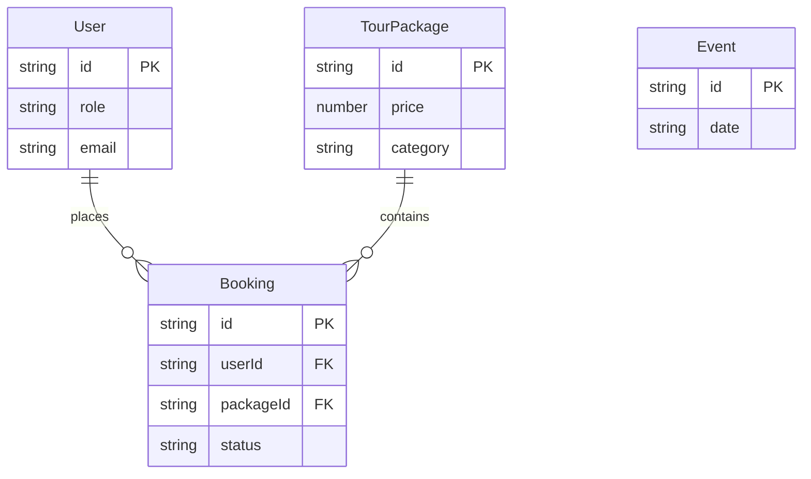

# Entity Relationship Diagram (ERD) - BorneoTrip

Dokumen ini menjelaskan struktur data yang digunakan dalam aplikasi. Karena aplikasi ini menggunakan **Frontend-First Architecture** tanpa database relasional (SQL), skema di bawah ini merepresentasikan struktur Objek JSON yang dikelola di memori/local storage.

## Entities

### 1. User
Menyimpan data pengguna (Traveler, Admin, Operator).
| Key | Type | Description |
| :--- | :--- | :--- |
| `id` | string | Unique identifier (e.g., `'usr1'`) |
| `name` | string | Nama lengkap user |
| `email` | string | Email login |
| `role` | enum | `'client' | 'admin' | 'staff'` |
| `avatar` | string | URL foto profil |
| `preferences` | object | Preferensi travel (opsional) |

### 2. TourPackage (Paket Wisata)
Menyimpan data produk wisata.
| Key | Type | Description |
| :--- | :--- | :--- |
| `id` | string | PKG-ID (e.g., `'pkg-derawan'`) |
| `title` | string | Nama paket wisata |
| `category` | string | Kategori (Nature, Culture, Adventure) |
| `duration` | string | Durasi (e.g., "3 Days 2 Nights") |
| `price` | number | Harga per pax dalam Rupiah |
| `location` | string | Lokasi utama |
| `rating` | number | Rating bintang (1.0 - 5.0) |
| `description` | string | Deskripsi singkat listing |
| `details` | object | Detail lengkap (overview, timeline) |
| `badges` | array | Label khusus (`['sustainable', 'best-seller']`) |

### 3. Event (Event Tahunan)
Menyimpan data festival atau event khusus.
| Key | Type | Description |
| :--- | :--- | :--- |
| `id` | string | Event ID |
| `title` | string | Nama event |
| `date` | string | Tanggal pelaksanaan |
| `location` | string | Tempat pelaksanaan |
| `description` | string | Deskripsi event |
| `price` | number | Harga tiket masuk (0 jika gratis) |
| `availableSeats` | number | Kapasitas tiket |
| `coordinates` | object | `{ lat: number, lng: number }` untuk peta |

### 4. Booking (Transaksi)
Menyimpan data transaksi pemesanan paket oleh user.
| Key | Type | Description |
| :--- | :--- | :--- |
| `id` | string | Booking ID (e.g., `'BK-123456'`) |
| `userId` | string | FK ke User.id |
| `userName` | string | Snapshot nama user saat booking |
| `packageId` | string | FK ke TourPackage.id |
| `pkgTitle` | string | Snapshot nama paket |
| `pkgImage` | string | Snapshot gambar paket |
| `date` | string | Tanggal keberangkatan (ISO String) |
| `pax` | number | Jumlah peserta |
| `totalPrice` | number | Total pembayaran (price * pax) |
| `status` | enum | `'Pending' | 'Paid' | 'Confirmed' | 'Completed'` |
| `createdAt` | string | Timestamp pembuatan booking |

## Relationships

