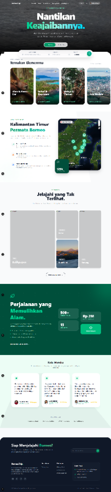
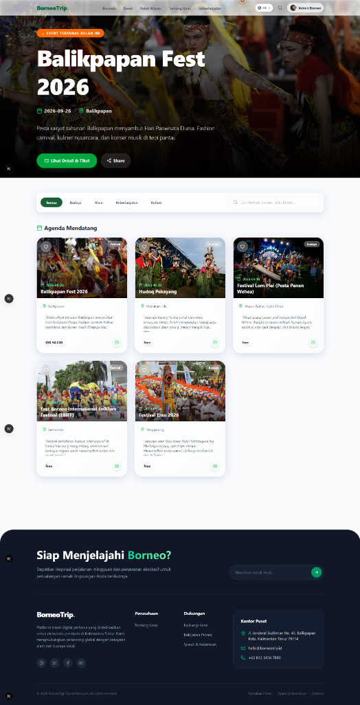
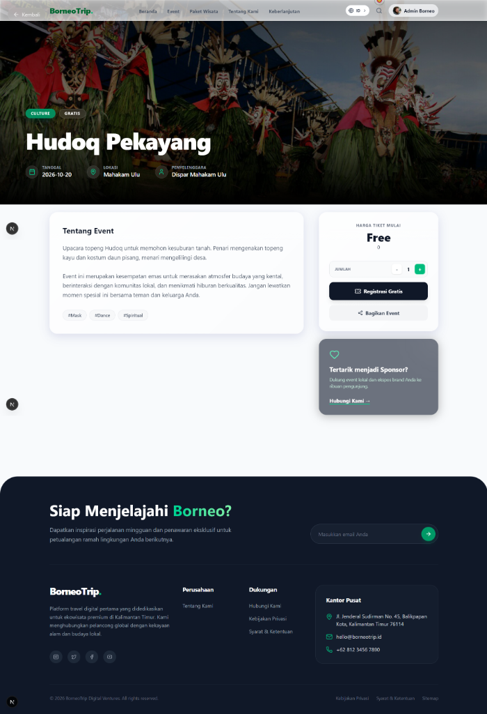
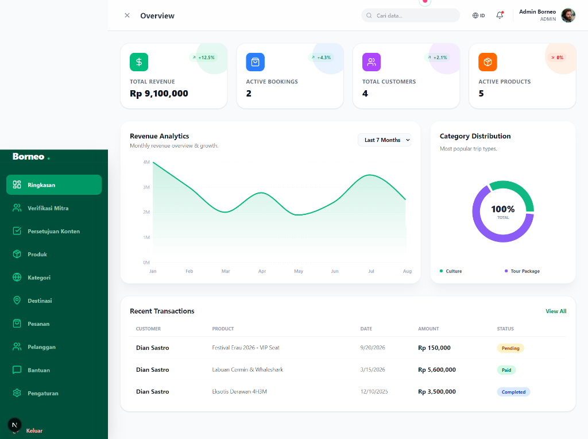

# 🌟 BorneoTrip Features & Visual Tour

Menjelajahi keindahan Kalimantan Timur kini lebih interaktif dan immersive. Dokumen ini menjelaskan fitur utama aplikasi beserta detail *Motion Design* yang diterapkan.

## 1. Immersive Landing Experience
> *"First impression matters. We bring Borneo's nature to your screen instantly."*

### ✨ Key Features
- **Cinematic Hero**: Video background/High-res image dengan overlay gradient yang halus.
- **Smart Search Widget**: Widget pencarian mengambang dengan efek *glassmorphism*.
- **Live Counters**: Statistik real-time (total destinasi, travelers) yang berjalan otomatis saat di-scroll.

### 🎭 Motion & UX Details
- **Entrance Animation**: Elemen teks dan tombol masuk dengan efek `fade-in-up` secara bertahap (staggered) menggunakan *Framer Motion*.
- **Parallax Scroll**: Background bergerak lebih lambat dari konten depan, menciptakan kedalaman visual.
- **Micro-interactions**: Tombol "Jelajahi" membesar sedikit (scale 1.05) saat di-hover dengan transisi spring yang kenyal.

---

## 2. Rich Event Exploration
> *"Discover culture through fluid interactions."*

### ✨ Key Features
- **Dynamic Filtering**: Filter kategori (Budaya, Alam, Kuliner) tanpa reload halaman.
- **Event Cards**: Kartu event dengan informasi tanggal, lokasi, dan harga tiket.
- **Auto-Pagination**: "Infinite scroll" atau load more yang mulus.

### 🎭 Motion & UX Details
- **Card Hover**: Saat kursor diarahkan ke kartu event:
    - Gambar membesar (zoom-in) perlahan.
    - Shadow kartu menjadi lebih lembut dan melebar.
    - Tombol aksi muncul dari bawah.
- **Layout Transition**: Saat mengganti filter, kartu yang tidak relevan menghilang (`opacity: 0`, `scale: 0.9`) dan kartu baru masuk dengan mulus (`LayoutGroup` Framer Motion).

---

## 3. Comprehensive Event Details
> *"Booking tickets seamlessly in a modern interface."*

### ✨ Key Features
- **Sticky Booking Widget**: Panel pemesanan yang tetap terlihat di sisi kanan saat user scroll deskripsi.
- **Interactive Gallery**: Grid foto yang bisa diklik untuk mode lightbox.
- **Related Events**: Rekomendasi event serupa di bagian bawah.

### 🎭 Motion & UX Details
- **Smooth Scrolling**: Navigasi antar bagian (Tentang, Lokasi, Tiket) meluncur dengan halus.
- **Ticket Counter**: Angka jumlah tiket berubah dengan animasi rolling number.
- **Success Feedback**: Saat tombol "Pesan Sekarang" ditekan, muncul animasi loading `spinner`, diikuti centang hijau `success` sebelum redirect.

---

## 4. Powerful Admin Dashboard
> *"Data-driven decisions with a beautiful command center."*

### ✨ Key Features
- **Real-time Analytics**: Grafik pendapatan dan booking yang terupdate otomatis.
- **Sidebar Navigation**: Menu navigasi responsif yang bisa diminimalkan.
- **Dark/Light Mode Ready**: Desain yang kontras dan nyaman di mata.

### 🎭 Motion & UX Details
- **Chart Animation**: Grafik garis (Line Chart) tergambar dari kiri ke kanan saat halaman dimuat.
- **Sidebar Slide**: Sidebar meluncur masuk/keluar dari sisi kiri dengan easing `easeInOutQuart`.
- **Table Hover**: Baris tabel di-highlight dengan warna background tipis saat di-hover untuk fokus membaca data.

---

*Dokumen ini dibuat untuk memberikan gambaran standar kualitas UI/UX yang diterapkan pada BorneoTrip.*
