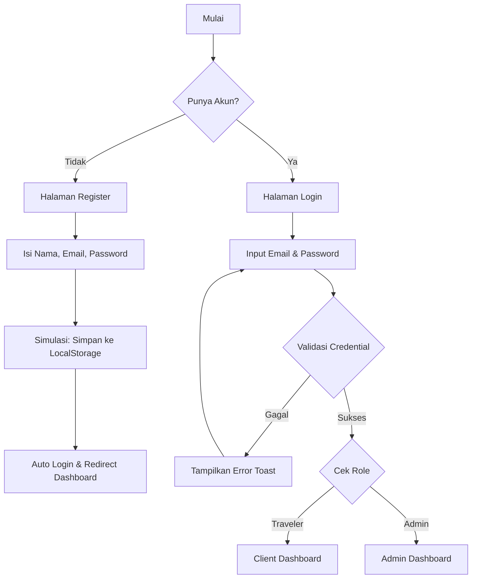

# User Flow Diagram

Dokumen ini menjelaskan alur perjalanan pengguna (User Journey) utama dalam aplikasi BorneoTrip.

## 1. Alur Registrasi & Login (Onboarding)



## 2. Alur Pemesanan Paket (Booking Flow)

```mermaid
graph LR
    A[Homepage] --> B[Klik 'Lihat Paket']
    B --> C[Halaman List Paket]
    C --> D[Pilih Paket Spesifik]
    
    D --> E[Halaman Detail Paket]
    E --> F[Lihat Itinerary & Fasilitas]
    F --> G[Pilih Tanggal & Jumlah Pax]
    G --> H[Klik 'Pesan Sekarang']
    
    H --> I[Halaman Checkout]
    I --> J[Review Pesanan]
    J --> K[Isi Data Kontak]
    K --> L[Simulasi Bayar]
    
    L --> M[Halaman Sukses]
    M --> N[Download E-Voucher]
    N --> O[Redirect ke Dashboard]
```



## 3. Alur Pencarian Event (Discovery Flow)

```mermaid
graph TD
    A[Homepage] --> B[Search Widget]
    B --> C{Pilih Tab}
    C -- Event --> D[Input Lokasi/Nama Event]
    C -- Paket --> E[Input Destinasi]
    
    D --> F[Tekan 'Cari']
    E --> F
    
    F --> G[Halaman Hasil Pencarian]
    G --> H[Filter Kategori (Culture/Nature)]
    H --> I[Klik Kartu Event]
    I --> J[Modal Detail Event / Remind Me]
```
